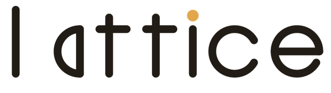
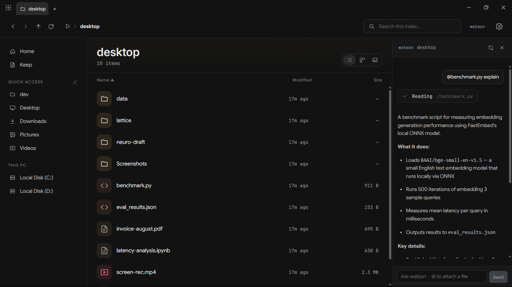

<p align="center">
  <picture>
    <source media="(prefers-color-scheme: dark)" srcset="docs/wordmark-light.png">
    
  </picture>
</p>

<p align="center">
  <b>An agentic workspace for your filesystem.</b><br>
  Find files by name, content, or meaning — then hand any of them to Watson.
</p>

<p align="center">
  <a href="https://github.com/lattice-fe/lattice/releases"></a>
  <a href="LICENSE"></a>
  
</p>

<p align="center">
  
</p>

Lattice indexes any folder and lets you find things instantly — by filename,
full text (SQLite FTS5), or **meaning** (local embeddings). It pairs that with
rich in-app previews, a Spotlight-style command palette, and **Watson** — an AI
assistant that searches and acts on your files. Fast where it counts, and a
place you actually like being.

## Features

- **Search that finds anything** — filename, full-text, and semantic search over any indexed folder, from a Spotlight-style palette (`Alt+Space`).
- **Watson AI assistant** — an in-app agent that searches your files, summarizes them, and manages notes. Bring your own OpenAI-compatible endpoint.
- **Built-in editor & viewers** — Monaco code editor with live Markdown / HTML preview, plus PDF, Jupyter, image, and spreadsheet viewers.
- **Keep** — native, local-first notes and checklists, with timed reminders.
- **`lat` CLI** — sub-10 ms filename / full-text / semantic search from your shell. See [docs/cli.md](docs/cli.md).
- **Beautiful, and yours** — 12 themes, a custom theme editor, and an opt-in integrated terminal.
- **Local-first & private** — your index and files never leave your machine.

## Install

Grab the latest installer from [**Releases**](https://github.com/lattice-fe/lattice/releases).

> **Platform:** Windows today. macOS and Linux are planned — the codebase is
> cross-platform (Tauri), but builds there aren't signed or tested yet.

## Build from source

Prerequisites: [Rust](https://rustup.rs) 1.77+, Node 18+, and the
[Tauri system dependencies](https://tauri.app/start/prerequisites/) for your OS.

```bash
git clone https://github.com/lattice-fe/lattice
cd lattice/app
npm install
npm run tauri dev      # run in development
npm run tauri build    # produce a release build
```

New here? [CONTRIBUTING.md](CONTRIBUTING.md) has the project layout and how to help.

## License

[AGPL-3.0](LICENSE) — free and open, and it stays that way: anything built on
Lattice must share its source under the same terms. No CLA — contributions are
made under the same license (inbound = outbound).

---

<p align="center">
  <a href="docs/cli.md"><code>lat</code> CLI</a> ·
  <a href="CHANGELOG.md">Changelog</a> ·
  <a href="CONTRIBUTING.md">Contributing</a>
</p>
